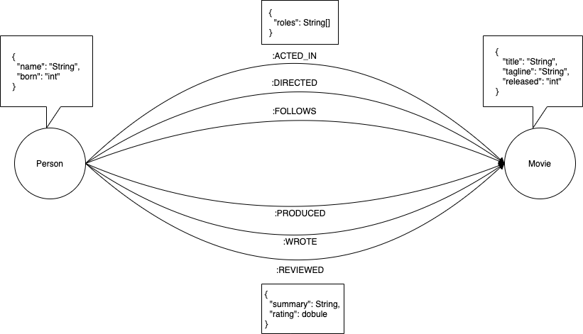

# Neo4J Spring Demo App

This is a simple spring demo application that connects to Neo4J graph database and executes some basic queries over initial demo dataset. 

## Run Application

```bash
docker-compose up -d 
```

## Load Initial Data

1. Open neo4j dashboard in browser `http://localhost:7474`

2. Copy [initial load data](src/main/resources/initial.data) into query input field and execute

This will create the movie graph!

## Data model

#### Nodes
* `Movie`
* `Person`
#### Relationships
* `(:Person)-[:ACTED_IN]->(:Movie)`
* `(:Person)-[:DIRECTED]->(:Movie)`
* `(:Person)-[:FOLLOWS]->(:Movie)`
* `(:Person)-[:PRODUCED]->(:Movie)`
* `(:Person)-[:REVIEWED]->(:Movie)`
* `(:Person)-[:WROTE]->(:Movie)`

## API
Purpose of this api is to test Neo4J and its features so only basic operations are implemented.

Open swagger in browser `http://localhost:8080/swagger/swagger-ui.html`

Api provides you following functionalities:
* List all movies for actor
* Find movie details by movie title
* Find all movies in database
* Find all actors in a movie
* Find all directors in database
* Find all review for a movie

## Examples

Some of example queries to try on this dataset:

### Find actor named Tom Hanks

```
MATCH (tom {name: "Tom Hanks"}) 
RETURN tom
```

### Find 10 people
```
MATCH (people:Person) 
RETURN people.name 
LIMIT 10
```

### Find movies released in 1990s
```
MATCH (nineties:Movie) WHERE nineties.released >= 1990 AND nineties.released < 2000 
RETURN nineties.title
```

### Find all Tom Hanks movies
```
MATCH (tom:Person {name: "Tom Hanks"})-[:ACTED_IN]->(tomHanksMovies) 
RETURN tom,tomHanksMovies
```

### Who directed "Cloud Atlas"
```
MATCH (cloudAtlas {title: "Cloud Atlas"})<-[:DIRECTED]-(directors) 
RETURN directors.name
```

### Tom Hanks co-actors
```
MATCH (tom:Person {name:"Tom Hanks"})-[:ACTED_IN]->(m)<-[:ACTED_IN]-(coActors) 
RETURN coActors.name
```

### Movies and actors up to 4 "hops" away from Kevin Bacon
```
MATCH (bacon:Person {name:"Kevin Bacon"})-[*1..4]-(hollywood)
RETURN DISTINCT hollywood
```

### Bacon path, the shortest path of any relationships to Meg Ryan
```
MATCH p=shortestPath(
(bacon:Person {name:"Kevin Bacon"})-[*]-(meg:Person {name:"Meg Ryan"})
)
RETURN p
```

### Find someone to introduce Tom Hanks to Tom Cruise
```
MATCH (tom:Person {name:"Tom Hanks"})-[:ACTED_IN]->(m)<-[:ACTED_IN]-(coActors),
  (coActors)-[:ACTED_IN]->(m2)<-[:ACTED_IN]-(cruise:Person {name:"Tom Cruise"})
RETURN tom, m, coActors, m2, cruise
```

### Delete all Movie and Person nodes, and their relationships
```
MATCH (n) DETACH DELETE n
```

## Resources

[Check Official Neo4J Documentation](https://neo4j.com/docs/)

[More Examples](https://neo4j.com/graphgists/)
